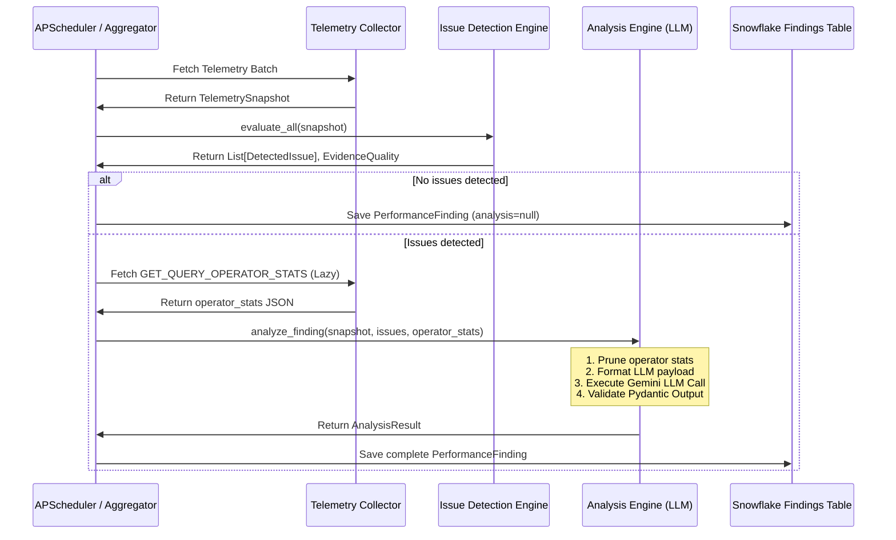
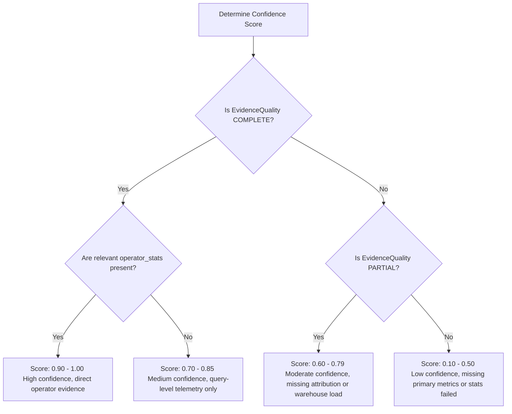

# Phase 5: Telemetry-Grounded Query Performance Analysis Engine

This document defines the architecture, design patterns, and operational boundaries of the **Phase 5 Query Performance Analysis Engine (LLM Layer)**. 

---

## 1. Architectural Role & Execution Workflow

The Analysis Engine is a stateless, telemetry-grounded enrichment service that executes downstream of the deterministic **Issue Detection Engine**. The Detection Engine remains the absolute source of truth; the Analysis Engine never re-detects issues, overrides severity levels, or alters threshold definitions. Its sole responsibility is to translate deterministic telemetry data into deep, actionable root cause explanations and telemetry-grounded optimization recommendations.

### Workflow Sequence

---

## 2. Core Design Principles

1. **Structured Outputs Only**: The engine strictly produces structured JSON matching the Pydantic contract. Markdown enclosures, conversational preambles, and conversational endings are completely forbidden.
2. **Telemetry Grounding**: Every statement in the Root Cause Analysis (RCA) and every recommendation must be explicitly linked to telemetry evidence (specific metrics, operator IDs, or query history statistics).
3. **No Agentic Complexity**: The system avoids multi-agent coordination, LangGraph, agent memory, reflection loops, and autonomous tool calling. It operates as a deterministic single-request/single-response inference pipeline.
4. **Failsafe Execution**: If the LLM call fails, times out, or produces invalid JSON repeatedly, the pipeline falls back gracefully, logging the error to the Dead Letter Queue (DLQ) and persisting the performance finding with a `null` analysis block to preserve pipeline throughput.
5. **Provider Abstraction**: Model interaction is decoupled from concrete SDKs via a lightweight provider interface, preparing the system for alternative providers (e.g., OpenRouter, Bedrock, Azure OpenAI) without modifying downstream layers.

---

## 3. Context & Telemetry Management (Operator Stats Pruning)

Raw execution operator statistics returned by `GET_QUERY_OPERATOR_STATS` can contain hundreds or thousands of nodes, easily exceeding LLM context windows or inflating token billing. 

To address this, the Analysis Engine applies a deterministic **Operator Pruning Algorithm** to extract only the most critical performance-affecting nodes before generating the prompt.

### The Pruning Algorithm

Given a raw list of operator statistics dictionary rows, the engine performs the following filtering steps:

1. **Include Spill Nodes**: Automatically retain any operator node where `BYTES_SPILLED_LOCAL > 0` or `BYTES_SPILLED_REMOTE > 0` (direct indicators of memory thrashing).
2. **Include Exploding Row Nodes**: Keep nodes where `RECORDS_PRODUCED` is substantially larger than `RECORDS_SCANNED` (e.g. ratio > 2.0 and `RECORDS_PRODUCED > 100,000`), which represents potential Cartesian products or massive join expansions.
3. **Include Bottleneck Nodes**: Sort the remaining nodes by `EXECUTION_TIME_FRACTION` in descending order. Retain the top $N$ nodes (where $N$ defaults to 5, configurable up to 10) that account for the highest execution duration.
4. **Include Filter & Scan Nodes for Poor Pruning**: If `POOR_PARTITION_PRUNING` is detected, automatically include TableScan nodes that scanned high numbers of partitions relative to total partitions.
5. **Pruning Output Bound**: Combine these subsets, deduplicate by `OPERATOR_ID`, and limit the total payload to a hard limit of **10 operators**.

### Operator Representation Schema
For the pruned operators, only a subset of fields is passed to the prompt:
- `OPERATOR_ID` (e.g., "Step 3")
- `OPERATOR_TYPE` (e.g., "TableScan", "HashJoin", "Aggregate")
- `EXECUTION_TIME_FRACTION` (e.g., 0.85)
- `RECORDS_PRODUCED` and `RECORDS_SCANNED`
- `BYTES_SPILLED_LOCAL` and `BYTES_SPILLED_REMOTE`
- `PARTITIONS_SCANNED` and `PARTITIONS_TOTAL` (for scan nodes)

---

## 4. Root Cause Analysis (RCA) Design

The generated Root Cause Analysis must be concise, technical, and factual. The LLM must reconstruct the sequence of events using the provided telemetry.

* **What happened**: A brief, high-level summary of the symptom (e.g., "The query execution took 342 seconds, with 87% of time spent on a single Join node spilling 4.5 GB to remote disk").
* **Why it happened**: Explaining the underlying system mechanics (e.g., "The warehouse ran out of local scratch space due to a lack of join filter predicates, forcing data redistribution across remote storage nodes").
* **Evidence Reference**: The narrative must directly quote metrics (e.g., `remote_spill = 4.5 GB`, `overall_duration = 342s`) and reference the specific operator IDs (e.g., `Join [Step 4]`).

---

## 5. Recommendation Framework & Guardrails

Recommendations are structured objects that guide operators on how to fix the issue. The Analysis Engine must classify each recommendation into one of the following categories:

| Category | Description | Supporting Telemetry Indicators |
| :--- | :--- | :--- |
| `QUERY` | SQL query rewrites or structure edits | Presence of Cartesian Joins, cross joins, or inefficient sorting. |
| `WAREHOUSE` | Resizing, clustering, or scaling settings | High `QUEUED_OVERLOAD_TIME` or significant `BYTES_SPILLED_REMOTE`. |
| `CONCURRENCY` | Multi-cluster warehouse tuning | Overlapping query start/end times, high average running/queued loads. |
| `COST_OPTIMIZATION` | Warehouse scaling policies, auto-suspend | High `credits_attributed` with low warehouse utilization. |
| `TABLE_DESIGN` | Table structure, types, clustering | High partitions scanned ratio on large tables (`POOR_PARTITION_PRUNING`). |
| `PARTITION_PRUNING` | Predicate pushdowns or filtering | Scanned fraction > 50% with low rows returned (`ROWS_PRODUCED / BYTES_SCANNED`). |
| `RESOURCE_CONTENTION`| Warehouse resource competition | Spilling across multiple concurrent queries on the same warehouse. |
| `DATA_MODELING` | Table layout, schemas, star-schemas | Explosive joins with massive output rows vs. input rows. |

### Recommendation Guardrails (Hard Constraints)

The LLM is strictly prohibited from suggesting changes without direct evidence. The prompting strategy enforces the following logic:

* **No "Scale Up" (WAREHOUSE)** unless:
  * `BYTES_SPILLED_REMOTE` is greater than 0, indicating memory exhaustion that cannot be solved by local disk caching, or
  * The query execution time is dominated by CPU-heavy processing on a small warehouse size and local spill is extremely large.
* **No "Clustering Changes" or "Partition Pruning Improvements" (TABLE_DESIGN / PARTITION_PRUNING)** unless:
  * The query telemetry shows `PARTITIONS_SCANNED / PARTITIONS_TOTAL > 0.5` AND the total scanned partition count is significant (e.g., > 100 partitions).
* **No "Concurrency Configuration changes" (CONCURRENCY)** unless:
  * The warehouse telemetry snapshot shows a non-zero `QUEUED_OVERLOAD_TIME` or the systemic `Avg Queued Load` exceeds 1.5 during the query execution timeframe.

---

## 6. Analysis Confidence Framework

To prevent the LLM from hallucinating root causes when telemetry is sparse, the system enforces a strict Confidence Score framework.

> [!IMPORTANT]
> The confidence score applies **only** to the quality of the LLM's RCA reasoning and recommendations. It does **not** evaluate the validity of the deterministic rules, threshold breaches, or severity calculations, which are factual.

### Confidence Score Schema
* **`score`**: A float ranging from `0.0` (complete uncertainty) to `1.0` (absolute certainty), rounded to 2 decimal places.
* **`reason`**: A concise sentence detailing why the score was assigned.

### Confidence Score Calibration

The LLM determines the confidence score based on the completeness of telemetry data (`EvidenceQuality`) and the presence of direct execution evidence:

* **High Confidence (0.90 - 1.00)**: `EvidenceQuality` is `COMPLETE`, and pruned operator statistics contain the exact nodes (e.g., `HashJoin`, `TableScan`) responsible for the triggered rule.
* **Medium Confidence (0.70 - 0.89)**: Telemetry is complete, but `operator_stats` are missing or failed to fetch (e.g., query expired from Snowflake execution cache). The LLM must reason purely from query-level metrics.
* **Low Confidence (0.10 - 0.69)**: `EvidenceQuality` is `PARTIAL` or `LIMITED` (e.g., missing critical fields or missing warehouse load history). The reasoning is speculative, and the LLM must explicitly list missing metrics as the reason for low confidence.

---

## 7. Cost Controls & Token Budgeting

To ensure cost predictability and performance limits, the Analysis Engine implements the following guardrails:

1. **Strict Context Budget**: Max inputs are limited to `15,000` tokens.
2. **Max Operator Limits**: A hard limit of **10 operators** per LLM call.
3. **Response Token Budget**: Capped at `1,500` tokens, which is more than sufficient for structured RCA and recommendations.
4. **Retry Budget**: If JSON validation fails or the provider times out, the system retries up to configured retries (default 3) using incremental backoff before returning fallback results or logging to DLQ. For 429 rate limit/quota errors, the system triggers an extended sleep period (15s+) to allow rate limits to reset.

---

## 8. Observability & Telemetry Metrics

For every execution, the system captures performance metadata to trace model behavior, cost, and latency over time. This metadata is saved inline under the `llm_metadata` field of the `AnalysisResult` model:

* **`provider`**: The LLM provider (e.g., `nvidia`).
* **`model`**: The specific model name and version used (e.g., `meta/llama-3.1-8b-instruct`).
* **`latency_ms`**: Time taken for the API request to complete.
* **`retries_count`**: Number of retries executed for this analysis.
* **`validation_failures`**: List of parser/validation errors encountered before a successful run.

---

## 9. Nvidia AI Endpoints Integration

The Analysis Engine supports provider backends selected dynamically via configuration:

### Nvidia AI Endpoints Provider
- **Execution client**: `ChatNVIDIA`
- **Base Endpoint**: Standard NVIDIA AI Endpoints or custom URL (e.g. `LLM_BASE_URL`).
- **Structured Response Fallback**:
  - **Attempt 1**: The provider first attempts to use LangChain's native `with_structured_output(...)` parser.
  - **Attempt 2 (Fallback)**: If native structured output fails or is unsupported by the target model, the provider injects JSON-only formatting instructions into the system prompt, parses raw markdown text responses to locate the JSON block, validates it against the expected Pydantic schema, and triggers retry loops in case of schema validation failures.
